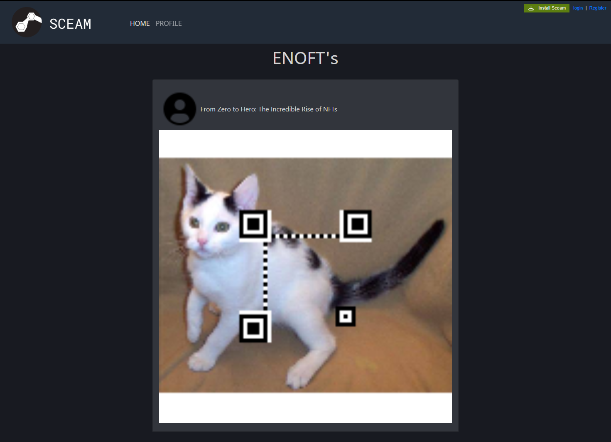
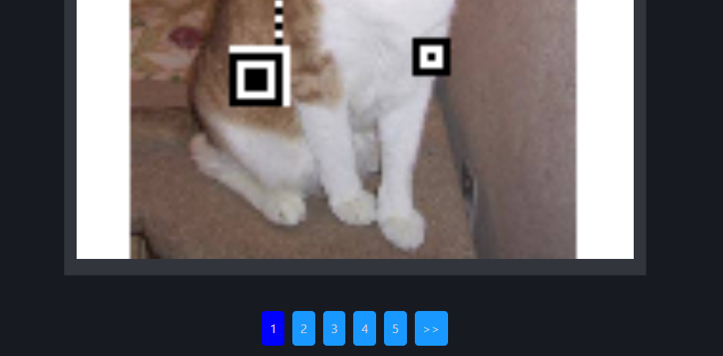
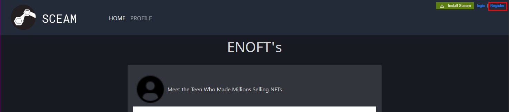
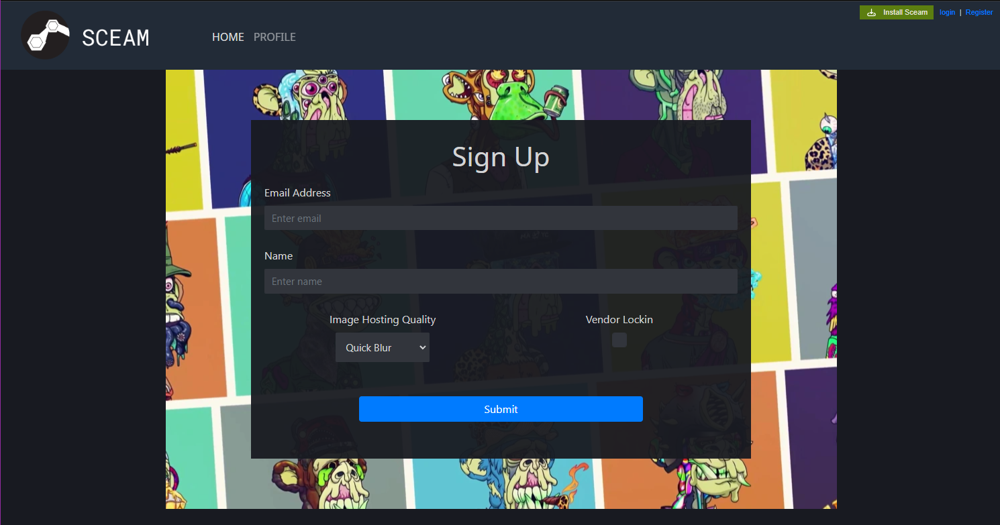
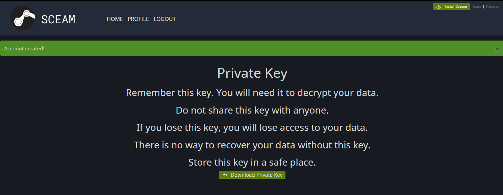
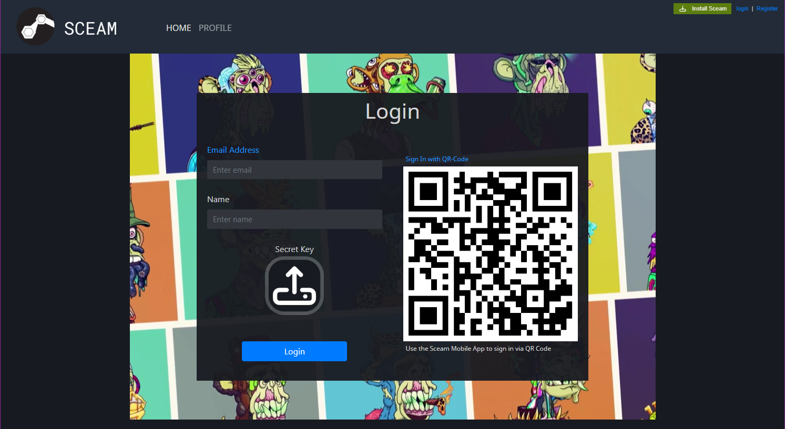
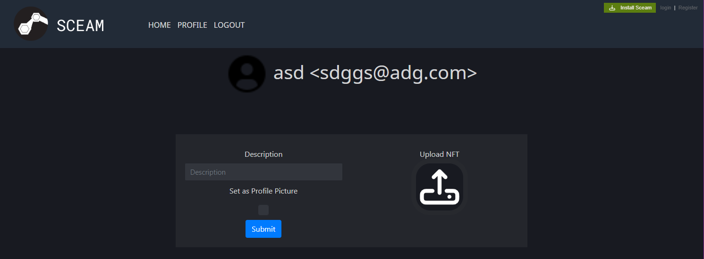
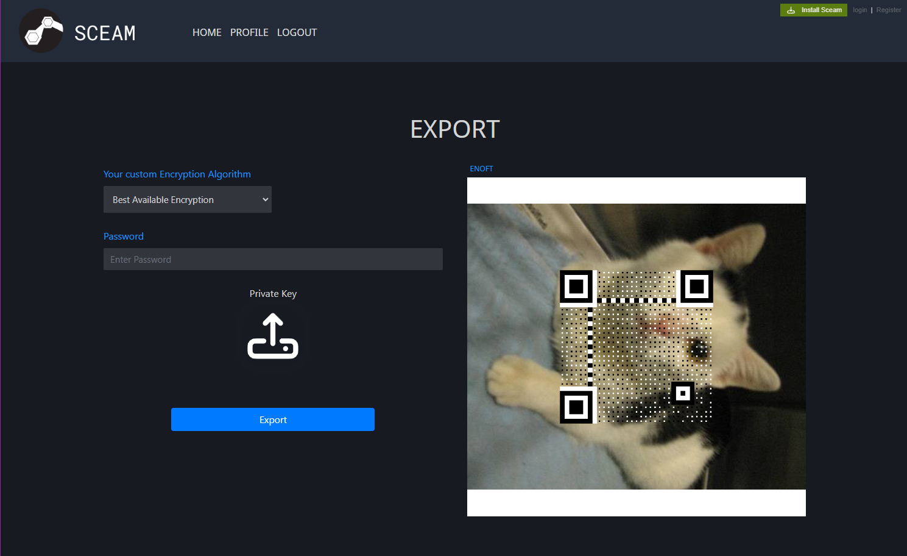
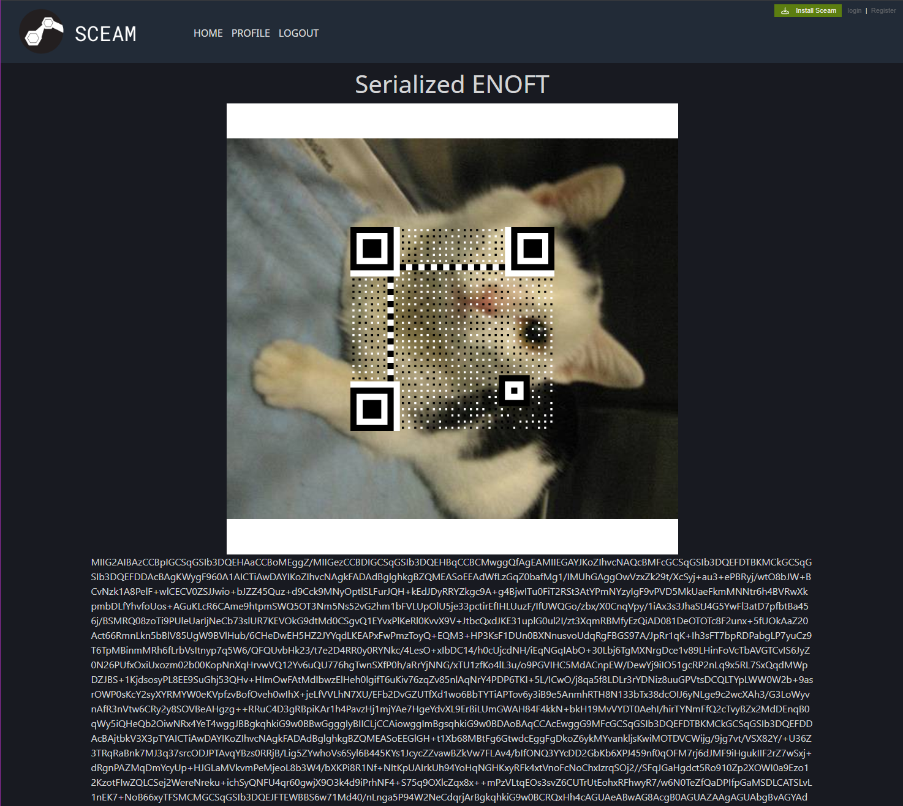

# Sceam Documentation

- [Introduction](#introduction)
- [Installation](#installation)
- [Usage](#usage)
  - [Viewing ENOFT's](#viewing-enofts)
  - [Creating an Account](#creating-an-account)
  - [Logging In](#logging-in)
  - [Creating an ENOFT](#creating-an-enoft)
  - [Exporting ENOFT's](#exporting-enofts)
- [Exploits and Fixes](#exploits-and-fixes)
  - [Ownership Faking](#ownership-faking)
  - [Export verification Bypass](#export-verification-bypass)
  - [Reversible Blur](#reversible-blur)
  - [Unintended Export](#unintended-export)
- [File Structure](#file-structure)
  - [Checker](#checker)
  - [Service](#service)
  - [Documentation](#documentation)
    - [Scripts](#scrips)
    - [Fixes](#fixes)

## Introduction

Sceam is a Steam clone turned into a social media platform for ENOFT's (NFT's). It is a full stack application that uses Flask. The application allows users to create an account and manage ENOFT's by posting and exporting them.

For the competition all flags are stored as qr codes in the images which are uploaded as ENOFT's. The goal is to find a method that either unblurs the image or one that displays a full sized image.

## Installation

There are two parts to the application, the checker and the service. The checker is interacted with by the ENOENGINE which then interacts with the service. The service is the main application that the user interacts with.

To run the application, you will need to have Docker installed.

### Running the Checker

```bash
git clone https://github.com/enowars/enowars8-service-SCEAM.git
cd enowars8-service-SCEAM
cd checker
docker compose up --build -d
```

### Running the Service

```bash
git clone https://github.com/enowars/enowars8-service-SCEAM.git
cd enowars8-service-SCEAM
cd service
docker compose up --build -d
```

## Usage

The service is reachable on port 8008.

### Viewing ENOFT's

The homepage directly allows you to view all the ENOFT's that have been posted. Clicking on an ENOFT will redirect you to the owners profile page.



Each page only displays the 5 newest ENOFT's. To view more, you can interact with the pagination at the bottom of the page.



### Creating an Account

To create an account, you can click on the `Register` button on the top right of the page.



You will be redirected to the registration page.



Here you can enter your **email** and **name**. Additionally you can select some account options.

**Vendor Lockin** : This option will dissable your ability to export images and leave the Sceam platform.

**Image Hosting Quality** : This option will allow you to select how your uploaded images are displayed.

- **Quick Blur** : This option will blur your image with the nearest pixel blur. This method is completely lossy and not reversible. Only the owner of the image can view the full image.
- **Never Full** : This option will also blur your image with the nearest pixel blur. This image is always shown blurry except when it is exported.
- **Advanced Blur** : This option will blur your image with a kernel blur. This method is reversible and can be unblurred enough to scan the qr code.
- **Full Quality** : This option will display the full image at all times.



After Registration you will get a chance to download your private key by clicking on the `Download Private Key` button at the bottom of the screen. This key is used to export your ENOFT's and to log in. Clicking the `Install Sceam` at the top right will redirect you to a rickroll.

### Logging In

When logging in you need to provide your name email and upload the private key you downloaded during registration.



Scanning the QR code is a foreshadowing of the flags and leads to a rickroll.

### Creating an ENOFT

On your profile page which can be accessed using the `Profile` button in the header you can upload your ENOFT's. This page also displays all the ENOFT's you have uploaded as well as you profile image, name and email.



To upload an ENOFT you have to upload an image using the button on the right. Additionally you can add a description to the image as well as set the image as your profile image.

### Exporting ENOFT's

To export an ENOFT you have to click on the image you want to export on the profile page. This will redirect you to the export page.



Here you have to provide your private key and select the encryption algorithm as well as password you want to use. After clicking the `Export` button you will be able to download the exported ENOFT.



## Exploits and Fixes

This service contains 3 Flagstores. All three flagstores deposit flags as qr codes in images. Retrieval is controlled by the account settings, which prevent flag leakage.

### Ownership Faking

#### Exploit CVE-2023-27043

The service uses the email address as the session key. By changing the email address in the session cookie, you can access other users' images. The way this is achieved is by setting your name to the email address of the user you want to impersonate and then logging in with your own email address. This will set the session cookie to your victims email address.

e.g.:

```python
from email.utils import parseaddr
print("Demonstrating CVE-2023-27043")
a = "alice@example.org"
b = "<bob@example.org>"
rfc2822_ADDRESS = "Thomas Dwyer<tdwyer@example.org>"
print("Parsing: '" + rfc2822_ADDRESS + "' as: ", parseaddr(rfc2822_ADDRESS))
tmp = parseaddr(a + "(" + b)
print("Parsing: '" + a + " (" + b + "' as: ", tmp)
print("got ", tmp[0], " and ", tmp[1])
print("expected ", a, " and ", b)

```

#### Fix CVE-2023-27043

There are two possible fixes for this issue. The first is to upgrade the python version, this will remove the CVE but you can run into dependacy issues. The second and inteded fix is to check not only the email address but also the name of the user when determining ownership.

This entails changing the [uploads](/service/src/user_profile.py) function to the following:

```python
@user_profile.route('/uploads/<path:path>', methods=['GET', 'POST'])
async def uploads(path):
    owner_email = ENOFT.query.filter_by(image_path=path).first().owner_email
    owner_name = User.query.filter_by(email=owner_email).first().name
    if session.get('name') is None:
        session_email = None
    else:
        session_email = parseaddr(session['name'])[1]
        session_name = parseaddr(session['name'])[0]
    owned = True if session_email == owner_email and session_name == owner_name else False
    quality = User.query.filter_by(email=owner_email).first().quality
    if not owned or quality in [0, 2]:
        logger.info(
            f"User {session_email} accessed image {path} lossy version")
        get_lossy_image_path(path, quality)
        return send_from_directory(
            current_app.config['LOSSY_IMAGE_UPLOADS'], path)
    else:
        logger.info(f"User {session_email} accessed image {path} full version")
        return send_from_directory(
            current_app.config['FULL_IMAGE_UPLOADS'], path)
```

### Export verification Bypass

#### Exploit CVE-2024-26130

The service does not directly verify the provided private key with the public key of the user. Instead it is assumed that serializing the image and certificate with the private key will only work if the private key is correct. `Cryptography` does verify this but when the serialization algorithm has an `HMAC` set, then the `NullPointer exception` is not caught and the thread crashes. This can be exploited by providing a random private key with an encryption algorithm that uses `HMAC` such as `.hmac_hash(hashes.SHA1())`.

#### Fix CVE-2024-26130

The root cause is the way errors are caught. Hence if the error message is set at the beggining and is later set to `None` this will catch crashes.

replace the [get_serialized](/service/src/ENOFT_exporter.py) function with the following

```python
def get_serialized(response):
    response['data'] = ''
    response['error'] = 'Something went wrong.'
    enoft = response['enoft']
    if not enoft:
        return None
    # catch exceptions and forward them
    try:
        certificate = enoft.certificate
        certificate_decoded = base64.b64decode(certificate)
        certificate_decerialized = cryptography.x509.load_pem_x509_certificate(
            certificate_decoded, default_backend())
        encryption_algorithm = get_encryption_algorithm(response)

        private_key = serialization.load_pem_private_key(
            response['private_key'], password=None, backend=default_backend())

        pkcs12_data = cryptography.hazmat.primitives.serialization.pkcs12.serialize_key_and_certificates(
            name=b'exported enoft',
            key=private_key,
            cert=certificate_decerialized,
            cas=[],
            encryption_algorithm=encryption_algorithm
        )
        response['data'] = base64.b64encode(pkcs12_data).decode('utf-8')
    except Exception as e:
        response['error'] = str(e)
        return None
    response['error'] = ''
    return response['data']

```

### Reversible Blur

#### Exploit kernel blur

If specified account settings then the image is blurred with a kernel blur. This blur is reversible and can be unblurred enough to scan the qr code. For this to work the kernel has to be known.

#### Fix kernel blur

The kernel can be changed to a random kernel or completely replaced with a different blur. This will make the blur irreversible.

e.g [get_lossy_image_path](/service/src/user_profile.py):

```python
def get_lossy_image_path(path, quality):
    lossy_path = os.path.join(current_app.config['LOSSY_IMAGE_UPLOADS'], path)
    if not os.path.exists(lossy_path):
        full_path = os.path.join(
            current_app.config['FULL_IMAGE_UPLOADS'], path)
        img = Image.open(full_path)
        if quality in [0, 1]:
            new_size = (img.size[0] // DOWNSCALE_FACTOR,
                        img.size[1] // DOWNSCALE_FACTOR)
            small_image = img.resize(new_size, Resampling.NEAREST)
            small_image.save(lossy_path)
        elif quality == 2:
            blur_sigma = 12  # Standard deviation for Gaussian kernel
            kernel_size = 20  # Kernel size used for blurring
            kernel_1d = cv2.getGaussianKernel(kernel_size, blur_sigma)
            kernel = np.outer(kernel_1d, kernel_1d.transpose())
            img = np.array(img.convert('RGB'))
            blurred_img = np.zeros_like(img, dtype=np.float32)
            for i in range(3):
                blurred_img[:, :, i] = cv2.filter2D(img[:, :, i], -1, kernel)
            blurred_img_float = blurred_img.astype(float) / 255.0
            blurred_img_8bit = np.clip(
                blurred_img_float * 255, 0, 255).astype(np.uint8)
            cv2.imwrite(lossy_path, cv2.cvtColor(
                blurred_img_8bit, cv2.COLOR_RGB2BGR))
        elif quality == 3:
            img.save(lossy_path)

    return lossy_path
```

### Unintended Export

During the competition an unintended exploit was found that allowed for the export of any image.

```python
@user_profile.route('/export_<path:path>', methods=['GET', 'POST'])
@login_required
async def export(path):
    if request.method == 'GET':
        logger.info(f"User {session['name']} exporting image {path}")
        return render_template("export.html", user=current_user, img_path=path)

    if request.method == 'POST':

        res = ENOFT_export()
        if res['error'] != '':
            flash('Error during export: ' + res['error'], 'error')
            logger.error(
                f"Error exporting image {path} by {session['name']}: {res['error']}")
            return redirect(
                url_for(
                    'user_profile.profile',
                    email=current_user.email))

        logger.info(
            f"User {session['name']} exported image {path} with {res['data']}")

        session['img_path'] = path
        return render_template(
            "show_serialization.html",
            user=current_user,
            certificate=res['data'])
```

This was due to the fact that there is a discreptancy between which image is checked and which image gets exported due to `session['img_path'] = path` since the exporter checks the request form and not the path.

This was fixed by changing the line to
`session['img_path'] = request.form['img']`

## File Structure

The Project is split into 3 main parts, the checker, the service and the documentation.
Additionally there are some scripts that were used for cleanup like `temp_remover.bat`

### Checker

Contains the checker for the service.

- `src` contains the checker code
- `src/backgrounds_org` contains the original backgrounds
- `src/background_processor.py` creates the preprocessed backgrounds which are saved in the `backgrounds` folder
- `src/checker.py` is the main checker script
- `src/qr_codes.py` creates and reads the qr codes for the flags
- `src/utils.py` contains the connection handler for the checker, which handles registration, logins, and flag/noise/havoc retrieval

### Service

Contains the main service code.

- `main.py` is the entrypoint for the service
- `cleanup.py` is a script that removes all flags from the service after they have expired
- `src` contains the main codebase
- `src/static` contains the static files for the service
- `src/templates` contains the html templates for the service
- `src/ENOFT_exporter.py` contains the export logic, which verifies the private key and creates the export
- `src/ENOFT_creator.py` contains the creation logic, which verifies the image and creates the associated certificate.
- `src/user_profile.py` contains the user profile logic, which handles the user profile and image uploads
- `src/__init__` contains the initialization logic for the service
- `src/auth.py` contains the authentication logic for the service
- `src/models.py` contains the database models for the service
- `src/views.py` contains home page logic for the service
- `src/user_encryption_builder.py` contains the parser for creating encryption algorithms based on user input

### Documentation

Contains the documentation for the service and multiple test scripts.

- `key_gen` contains a stresstest for the key generation
- `qr_codes` contains a multitude of ways to generate qr codes and the coresponding stresstests
- `reversing` contains the qrcode unblurring script
- `scoreboard` contains the scoreboard summarizing script and a visualiztion for the scoreboard
- `stress_test` contains a stresstest for the service
- `cleanup_stress.py` when running for a very long time the service can run out of space. This script is used to clean up the service
